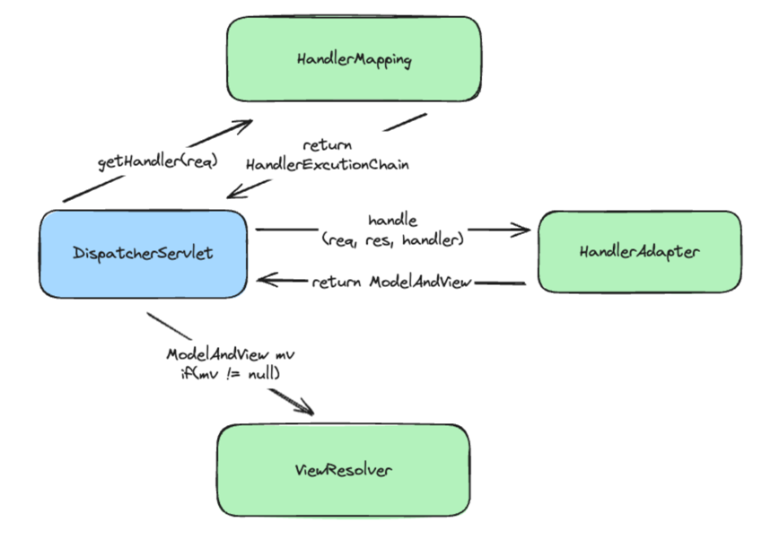

# DispatcherSerlvet 알아보기

스프링 동작에서 `DispatcherServlet`은 핵심적인 역할을 한다. 
때문에 `DispatcherServlet`의 구조와 역할에 대한 지식은 스프링 프레임워크를 사용하는 개발자의 디버깅에 크게 도움이 되기도 한다.
이번 글에서는 백엔드 디버깅에 도움이 될 수 있도록 가볍게 `DispatcherServlet`을 알아보자.   

스프링 프레임워크를 최소 한 번은 사용하여 웹 개발을 해 본 경험이 있다면 글을 읽기 수월할 것이다.

## DispatcherServlet의 구조
먼저, `DispatcherServlet`의 핵심이 되는 객체들과 그 역할을 알아보면서 `DispatcherServlet`의 구조를 이해해 보자.

### DispatcherServlet
`DispatcherSerlvet`의 가장 주요한 기능은 웹 요청을 해당 요청을 처리할 수 있는 Handler 로 분배하는 것이다. 그리고, 이 역할이 `doDispatch()` 메서드로 구현이 되어 있다.

아래는 `doDispatch()` 메서드를 단순화한 코드이다.

```java
protected void doDispatch(HttpServletRequest request, HttpServletResponse response) throws Exception {  
    HandlerExecutionChain mappedHandler = null;  
    ModelAndView mv = null;  
    Exception dispatchException = null;  
  
    try {  
        mappedHandler = this.getHandler(request);  
        if (mappedHandler == null) {  
            this.noHandlerFound(request, response);  
            return;
        }  
  
        HandlerAdapter ha = this.getHandlerAdapter(mappedHandler.getHandler());  
          
        if (!mappedHandler.applyPreHandle(request, response)) {  
            return;
        }  
        
        mv = ha.handle(request, response, mappedHandler.getHandler());  
  
        mappedHandler.applyPostHandle(request, response, mv);
    } catch (Exception e) {
        dispatchException = e;
    }  
      
	this.render(mv, request, response); 
}
```

크게 사용되는 클래스는 `HandlerExecutionChain`, `ModelAndView`, `HandlerAdapter`인 것을 확인할 수 있다.
각각의 클래스의 역할을 알아보자.

### HandlerExecutionChain

```java
  
package dispatcherServlet;  
  
import java.util.ArrayList;  
import java.util.List;  
  
import jakarta.servlet.http.HttpServletRequest;  
import jakarta.servlet.http.HttpServletResponse;  
  
import org.springframework.lang.Nullable;  
import org.springframework.web.servlet.HandlerInterceptor;  
import org.springframework.web.servlet.ModelAndView;  
  
public class HandlerExecutionChain {  
  
    private final Object handler;  
    private final List<HandlerInterceptor> interceptorList;  
    private int interceptorIndex;  
  
    public HandlerExecutionChain(Object handler, List<HandlerInterceptor> interceptorList) {  
        this.interceptorList = new ArrayList();  
        this.interceptorIndex = -1;  
        this.handler = handler;  
  
        this.interceptorList.addAll(interceptorList);  
    }  
  
    boolean applyPreHandle(HttpServletRequest request, HttpServletResponse response) throws Exception {  
        for (HandlerInterceptor interceptor : interceptorList) {  
			if (!interceptor.preHandle(request, response, this.handler)) {  
		        this.triggerAfterCompletion(request, response, null);  
		        return false;  
			}  
		}
        return true;  
    }  
  
    void applyPostHandle(HttpServletRequest request, HttpServletResponse response, @Nullable ModelAndView mv) throws Exception {    
		for (HandlerInterceptor interceptor : interceptorList) {  
		    interceptor.postHandle(request, response, this.handler, mv);  
		}
    }   
      
	public Object getHandler() {  
	    return this.handler;  
	}
}
```

보는 바와 같이 `HandlerExecutinChain`은 `List<HandlerInterceptor>`을 필드로 가진다.
`applyPreHandle()`과 `applyPostHandle`은 등록된 `HandlerInterceptor`들을 순회하며 각각의 메서드 `HandlerInterceptor.preHandle()`, `HandlerInterceptor.postHandle()`을 호출한다.

또, 핸들러를 `Object` 타입의 필드로 가지며 `getHandler()` 메서드로 핸들러를 반환한다.

즉, 우리가 등록하는 인터셉터들이 이곳에 등록됨을 알 수 있다.

### HandlerAdapter

`HandlerAdapter`는 인터페이스이다. 명세는 아래와 같이 정의된다.

```java  
package org.springframework.web.servlet;  
  
import jakarta.servlet.http.HttpServletRequest;  
import jakarta.servlet.http.HttpServletResponse;  
import org.springframework.lang.Nullable;  
  
public interface HandlerAdapter {  
    boolean supports(Object handler);  
  
    @Nullable  
    ModelAndView handle(HttpServletRequest request, HttpServletResponse response, Object handler) throws Exception;  
}
```

`HandlerAdapter`는 `handler`의 다양한 형태를 `DispatcherSerlvet`이 일관된 방식으로 처리하도록 만들어 준다.
조금 뒤에 두 가지 서로 다른 형태의 `handler`를 확인해 보자.

### ModelAndView

`ModelAndView`는 핸들러가 반환하는 model 과 view 를 묶기 위한 객체이다.
`view`는 응답 화면 정보를 담고 있으며, `Model`은 `Map<String, Object>` 형식으로 응답에 포함할 정보들을 담는다.

### DispatcherServlet 메서드 돌아보기

이제 다시 `DispatcherServlet.doDispatch()` 메서드를 살펴보자.
먼저, 사용자 요청을 처리할 수 있는 핸들러를 가져온다. 이때의 핸들러는 우리가 등록해 둔 인터셉터 체인을 함께 포함한다.
다음으로, 조회한 핸들러를 DispatcherServlet 에서 사용하기 위해 알맞은 `HandlerAdapter`를 가져온다.

요청을 처리하기 전, `HandlerExecutionChain`에 등록되어 있는 인터셉터들을 호출하여 전처리 과정을 진행한다.
이후, `HandlerAdapter.handle()` 메서드를 호출하여 요청을 처리하고, `ModelAndView`를 반환받는다.
요청 처리가 끝나면 다시 `HandlerExecutionChain`의 인터셉터들을 호출해 후처리 과정을 진행한다.
마지막으로 `processDispatchResult()` 메서드를 호출해 요청 처리 결과에 따른 작업을 진행한다.
이 단계에서 `View.render()`를 호출하여 응답 화면을 반환하는 과정이 포함된다.

## DispatcherServlet 동작 파헤치기

이번엔 조금 더 `DispatcherServlet`의 동작을 자세히 살펴보자.

### Handler 가져오기

그렇다면, 요청에 맞는 `HandlerExecutionChain`은 어떻게 찾아 오는 것일까?
아래는 `DispatcherServlet.getHandler`의 코드를 단순화 한 것이다.

```java
@Nullable  
private List<HandlerMapping> handlerMappings;  

@Nullable  
protected HandlerExecutionChain getHandler(HttpServletRequest request) throws Exception {  
	if (this.handlerMappings != null) {  
		Iterator iterator = this.handlerMappings.iterator();  
		while (iterator.hasNext()) {  
			HandlerMapping mapping = (HandlerMapping) iterator.next();  
			HandlerExecutionChain handler = mapping.getHandler(request);  
			if (handler != null) {  
				return handler;  
			}  
		}  
	}  
	return null;  
}  
```

`DispatcherServlet` 은 `List<HandlerMapping>` 을 순회하며 요청을 처리할 수 있는 핸들러를 받아온다.
이 `HandlerMapping` 역시 인터페이스이며, 아래와 같이 정의되어 있다.

```java
public interface HandlerMapping {  
  
    @Nullable  
    HandlerExecutionChain getHandler(HttpServletRequest request) throws Exception;  
}
```

### HandlerAdapter 가져오기

이번엔 `getHandlerAdapter` 를 살펴보자.

```java
@Nullable  
private List<HandlerAdapter> handlerAdapters;  

protected HandlerAdapter getHandlerAdapter(Object handler) throws ServletException {  
	if (this.handlerAdapters != null) {  
		Iterator var2 = this.handlerAdapters.iterator();  

		while (var2.hasNext()) {  
			HandlerAdapter adapter = (HandlerAdapter) var2.next();  
			if (adapter.supports(handler)) {  
				return adapter;  
			}  
		}  
	}  
	throw new ServletException("No adapter for handler [" + handler + "]: "  
			+ "The DispatcherServlet configuration needs to include a HandlerAdapter that supports this handler");  
}  
```

`getHandler`와 달리 `HandlerAdapter`는 직접 모든 리스트를 `DispatcherServlet`에서 가지고 있다가, `handler`를 지원할 수 있는 `HandlerAdapter`를 찾아서 반환해 준다.

### 화면 반환하기

마지막으로, 응답에 해당하는 view를 반환하는 방법을 알아보자.

```java  
public class dispatcherServlet {  
    
    @Nullable  
    private List<ViewResolver> viewResolvers;  
  
    protected void render(ModelAndView mv, HttpServletRequest request, HttpServletResponse response) throws Exception {  
        Locale locale = this.localeResolver != null ? this.localeResolver.resolveLocale(request) : request.getLocale();  
        response.setLocale(locale);  
        String viewName = mv.getViewName();  
        View view;  
  
        if (viewName != null) {  
            view = this.resolveViewName(viewName, mv.getModelInternal(), locale, request);  
            if (view == null) {  
                throw new ServletException("Could not resolve view with name '" + mv.getViewName() + "' in servlet with name '"  
                        + this.getServletName() + "'");  
            }  
        } else {  
            view = mv.getView();  
            if (view == null) {  
                throw new ServletException("ModelAndView [" + mv  
                        + "] neither contains a view name nor a View object in servlet with name '"  
                        + this.getServletName() + "'");  
            }  
        }  
  
        view.render(mv.getModelInternal(), request, response);  
    }  
  
    @Nullable  
    protected View resolveViewName(String viewName, Locale locale) throws Exception {  
        if (this.viewResolvers != null) {  
            Iterator var5 = this.viewResolvers.iterator();  
  
            while (var5.hasNext()) {  
                ViewResolver viewResolver = (ViewResolver) var5.next();  
                View view = viewResolver.resolveViewName(viewName, locale);  
                if (view != null) {  
                    return view;  
                }  
            }  
        }  
        return null;  
    }  
}
```

`DispatcherServlet`은 `ModelAndView.getViewName()`, 또는 `ModelAndView.getView()`의 값을 활용해 적절히 `View`를 반환한다.

`ViewResolver` 역시 인터페이스이며, 아래와 같이 정의되어 있다.

```java
public interface ViewResolver {  
    @Nullable  
    View resolveViewName(String viewName, Locale locale) throws Exception;  
}
```

즉, `View`의 이름과 언어 정보를 활용해 적절한 `View`를 반환해 준다.

### 정리하기

아래는 지금까지 알아본 `DispatcherServlet`의 흐름을 간단하게 도식화한 것이다. 보이는 것과 같이 여러 인터페이스와 의존관계를 가지고 있다.



## DispatcherServlet의 실제동작

이번엔 `DispatcherServlet`을 디버깅하면서 실제 동작을 확인해 보자.

### 뷰 이름을 반환하는 Controller

먼저, 뷰 이름을 `String`으로 반환하는 `Controller`의 요청 처리 과정을 확인해 보자.
아래의 컨트롤러를 사용할 것이다.

```java
@Controller  
public class ViewNameController {  
  
    @GetMapping("index")  
    public String index() {  
        return "index.html";  
    }  
}
```

"localhost:8080/index"로 요청을 보낸 후 DispatcherServlet을 살펴보자.

### 핸들러 가져오기

먼저 아래의 핸들러를 가져오는 메서드를 더 살펴본다.
```java
@Nullable  
protected HandlerExecutionChain getHandler(HttpServletRequest request) throws Exception {  
    if (this.handlerMappings != null) {  
        Iterator var2 = this.handlerMappings.iterator();  
  
        while(var2.hasNext()) {  
            HandlerMapping mapping = (HandlerMapping)var2.next();  
            HandlerExecutionChain handler = mapping.getHandler(request);  
            if (handler != null) {  
                return handler;  
            }  
        }  
    }  
  
    return null;  
}
```

`DispatcherServlet`에 등록된 `HandlerMapping`은 총 6개가 존재하는 것을 확인할 수 있다.


반복문을 돌아 우리의 요청을 처리할 수 있는 구현체인 `RequestMappingHandlerMapping`을 찾았다.

(참고)
`RequestMappingHandlerMapping`은 계층적으로 추상클래스를 상속하고 있으며, 상위 클래스 중 `AbstractHandlerMapping`는 `HandlerMapping` 인터페이스를 구현한다.
`AbstractHandlerMapping.getHandler()` 메서드는 추상 메서드인 `getHandlerInternal()`을 호출하며, `RequestMappingHandlerMapping`의 상위 클래스인 `RequestMappingInfoHandlerMapping`가 이를 구현하고 있다.


이렇게 조회된 `HandlerExecutionChain mappedHandler`는 다음과 같은 형태를 가지고 있다.


`ObjectHandler` 로는 우리가 등록했던 `ViewNameController` 컨트롤러의 `index()` 메서드를 `HandlerMethod` 타입으로 가지고 있는 것을 확인할 수 있다.

### HandlerAdapter 가져오기

다음으론 `getHadlerAdapter` 동작을 살펴보자.

```java
protected HandlerAdapter getHandlerAdapter(Object handler) throws ServletException {  
    if (this.handlerAdapters != null) {  
        Iterator var2 = this.handlerAdapters.iterator();  
  
        while(var2.hasNext()) {  
            HandlerAdapter adapter = (HandlerAdapter)var2.next();  
            if (adapter.supports(handler)) {  
                return adapter;  
            }  
        }  
    }  
  
    throw new ServletException("No adapter for handler [" + handler + "]: The DispatcherServlet configuration needs to include a HandlerAdapter that supports this handler");  
}
```

`HandlerAdapter`는 총 4개가 등록되어 있다.


이후 `HandlerMethod` 형식의 핸들러를 지원할 수 있는 `RequestMappingHandlerAdapter`를 찾아서 반환해 주는 것을 확인할 수 있다.

(참고)
`RequestMappingHandlerAdapter`는 추상 클래스 `AbstractHandlerMethodAdapter`를 상속하고 있으며, 상위 클래스인 `AbstractHandlerMethodAdapter`는 `HandlerAdapter` 인터페이스를 구현한다.
`AbstractHandlerMethodAdapter.handle()` 메서드는 추상 메서드인 `handleInternal()`을 호출하며, `RequestMappingHandlerAdapter`가 이를 구현하고 있다.

`RequestMappingHandlerAdapter.handleInternal()`은 내부에서 적절히 요청을 처리한 후 `ModelAndView`를 반환한다.


`ModelAndView`의 `View`에는 `String`으로 반환될 정적 파일의 이름이 들어있다.

### 화면 렌더링하기

마지막으론 `ModelAndView`를 사용해 응답 화면을 제공하는 단계이다.

```java  
@Nullable  
protected View resolveViewName(String viewName, Locale locale) throws Exception {  
	if (this.viewResolvers != null) {  
		Iterator var5 = this.viewResolvers.iterator();  

		while (var5.hasNext()) {  
			ViewResolver viewResolver = (ViewResolver) var5.next();  
			View view = viewResolver.resolveViewName(viewName, locale);  
			if (view != null) {  
				return view;  
			}  
		}  
	}  
	return null;  
}  
```


`ContentNegotiatingViewResolver`가 사용되며 `ThymeleafView`를 반환하고 있다.

### 정리

View 이름을 `String`으로 반환하는 경우, 다음과 같은 객체의 협업이 이루어지는 것을 볼 수 있다.


## 마치며

지금까지 스프링의 동작에 사용되는 클래스들과 해당 클래스의 책임, 각 객체간의 협업을 살펴보았다.
스프링은 OOP를 잘 활용한 프레임워크로 유명하며, 이번 글에서도 그 점을 확인할 수 있다.
대부분의 협력 객체는 인터페이스로 추상화되어 있으며, 구현 클래스 역시 대부분 추상 클래스를 상속한다.
이 덕분에 다양한 요청들에 대해 협력하는 객체를 쉽게 다른 객체로 교체할 수 있으며, 다양한 요청을 처리할 수 있다.

스프링을 사용할 때 `DispatcherServlet`의 흐름을 잘 이해한다면 트러블슈팅의 갈피를 잡기 쉬워질 것이다.
